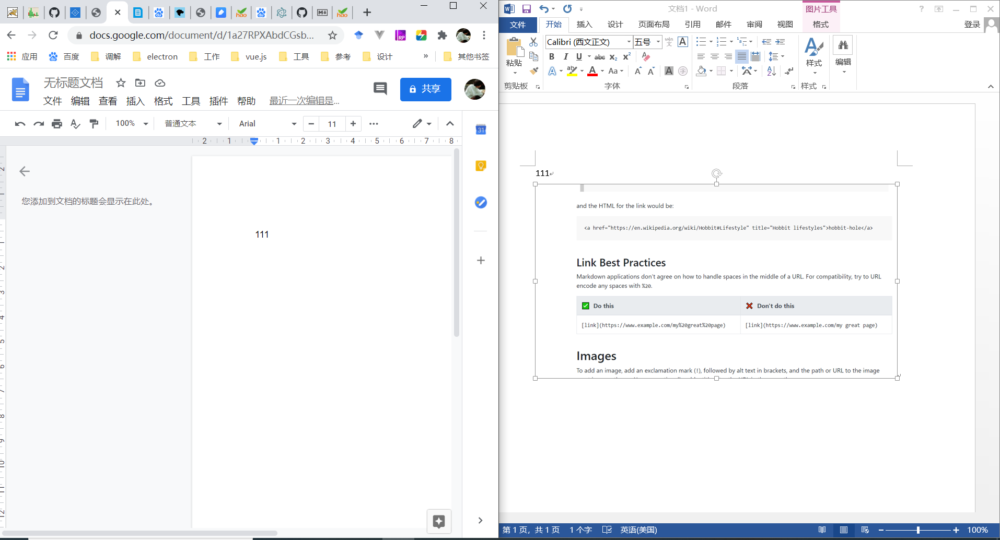

## 从本地word粘贴图片问题汇总  

场景：复制粘贴数据到浏览器富文本编辑器  
技术：浏览器的paste事件可以获取粘贴内容[onpaste事件](https://developer.mozilla.org/zh-CN/docs/Web/API/HTMLElement/onpaste)  
问题：当粘贴内容有图片时，普通QQ、微信截图。浏览器粘贴事件可以获取图片数据，而从word复制或者本地图片右键复制时，却获取不到图片数据(只能获取到图片本地路径)。 由于浏览器的安全限制导致不能访问本地磁盘文件，从而导致图片获取失败。  
解决方式：使用控件进行本地磁盘的文件读取操作, 例如使用[electron](http://www.electronjs.org/)做一个读取文件托盘程序

没有实现例子： 谷歌文档直接忽略图片内容，复制后内容展示如下  
  

实现例子：当前有几种富文本编辑器可以实现图片复制功能  
实现技术方式推测：
- ewebeditor[官网demo链接](http://www.ewebeditor.net/demo/)    
使用控件进行文件上传，上传后，使用接口获取上传服务器后图片地址，进行显示
  
  
  
  

- TinyMCE[官网](https://www.tiny.cloud/)  
使用powerpaste插件实现[使用方式](https://github.com/fangcw/tinymce_powerpaste)  
实现技术：使用flash获取本地磁盘图片(chrome在2020年底将不再支持flash)  
 
 
 

